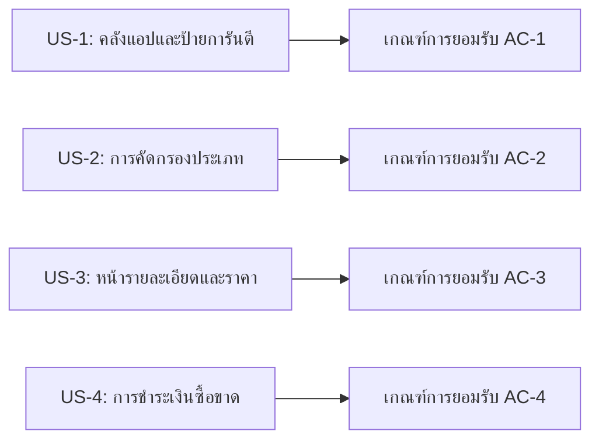

# 📋 Part 3: Acceptance Criteria — The One-Time Shop (MVP กลุ่ม 2)
### เกณฑ์การยอมรับผลงานและทดสอบระบบ (User Stories & Acceptance Criteria)

> **เอกสารอ้างอิง:** [message.txt](file:///D:/Thanatpreecha/lab-doc/message.txt) และ [A.txt](file:///D:/Thanatpreecha/lab-doc/A.txt)  
> **เอกสารในชุดโครงการ:**
> 1. [Project Charter](file:///D:/Thanatpreecha/lab-doc/docs/project_charter.md)
> 2. [Requirements Specification](file:///D:/Thanatpreecha/lab-doc/docs/requirements_specification.md)
> 3. [Acceptance Criteria](file:///D:/Thanatpreecha/lab-doc/docs/acceptance_criteria.md) *(เอกสารนี้)*
> 4. [Database Design](file:///D:/Thanatpreecha/lab-doc/docs/database_design.md)

---

## 1. นิยามความสำเร็จของการส่งมอบ (Definition of Done - DoD)

ระบบหรือ User Story แต่ละส่วนจะถือว่าผ่านเกณฑ์การยอมรับ (Accepted) เมื่อ:
1. ฟังก์ชันทำงานได้ตรงตาม Scenario ทั้งหมด (Positive & Negative Test Cases)
2. มีการแสดงผลที่ถูกต้องและเป็น Responsive Design บนทุกขนาดหน้าจอ
3. ข้อมูลราคาและเงื่อนไขต้องมีความโปร่งใส 100% ปราศจากค่าใช้จ่ายแอบแฝง
4. ซอร์สโค้ดผ่านการตรวจเช็กและรันได้บน Visual Studio

---

## 2. User Stories และเกณฑ์การยอมรับ (Given-When-Then Format)

---

### 2.1 US-1: การเรียกดูคลังแอปคัดสรรและป้ายการันตี (Curated Catalog & Badges)

**User Story:**
> *ในฐานะผู้ใช้งานทั่วไป ฉันต้องการดูคลังซอฟต์แวร์ที่ผ่านการคัดสรรพร้อมป้ายรับรองความน่าเชื่อถือ เพื่อให้ฉันมั่นใจว่าซอฟต์แวร์ที่สนใจเป็นแบบซื้อขาดและมีความยั่งยืนจริง*

#### Scenario 1.1: แสดงรายการแอปพร้อมป้ายการันตีครบถ้วน
* **Given (กำหนดให้):** ผู้ใช้เปิดเข้ามาที่หน้าแรกของ The One-Time Shop
* **When (เมื่อ):** ระบบโหลดข้อมูลคลังซอฟต์แวร์เสร็จสมบูรณ์
* **Then (ดังนั้น):** การ์ดซอฟต์แวร์แต่ละรายการต้องแสดงข้อมูล:
  * ชื่อแอป, ไอคอน, สรุปฟังก์ชันสั้นๆ
  * ราคาซื้อขาด (One-Time Price)
  * ป้ายการันตีอย่างน้อย 1 ป้าย เช่น `🛡️ One-Time Certified`, `🌱 Sustainable Badge`, `⚡ No Hidden Fees`
  * คะแนนความยั่งยืน (Sustainable Score)

#### Scenario 1.2: คลิกดูความหมายของป้ายการันตี (Badge Tooltip)
* **Given (กำหนดให้):** ผู้ใช้เห็นป้ายการันตีบนการ์ดซอฟต์แวร์
* **When (เมื่อ):** ผู้ใช้นำเมาส์ไปชี้ (Hover) หรือคลิกที่ป้ายการันตี
* **Then (ดังนั้น):** ระบบต้องแสดง Tooltip/คำอธิบายมาตรฐานของป้ายนั้น เช่น "รับรองว่าเป็นซอฟต์แวร์ซื้อขาดแท้ 100% ใช้งานได้ตลอดไปโดยไม่มีค่าบริการรายเดือน"

---

### 2.2 US-2: การคัดกรองหมวดหมู่และประเภทราคา (Category & Smart Filter)

**User Story:**
> *ในฐานะ Freelancer / Programmer ฉันต้องการกรองซอฟต์แวร์ตามหมวดหมู่งานและรูปแบบการชำระเงิน เพื่อค้นหาเครื่องมือที่ตรงกับความต้องการและงบประมาณได้อย่างรวดเร็ว*

#### Scenario 2.1: กรองตามหมวดหมู่การใช้งาน
* **Given (กำหนดให้):** ผู้ใช้อยู่ในหน้าร้าน The One-Time Shop
* **When (เมื่อ):** ผู้ใช้เลือกหมวดหมู่ "Developer Tools"
* **Then (ดังนั้น):** ระบบต้องแสดงเฉพาะซอฟต์แวร์ที่อยู่ในหมวด Developer Tools เท่านั้น และอัปเดตจำนวนผลลัพธ์ทันที

#### Scenario 2.2: กรองแบบหลายเงื่อนไข (Multi-filtering)
* **Given (กำหนดให้):** ผู้ใช้เลือกหมวดหมู่ "Design & Creative"
* **When (เมื่อ):** ผู้ใช้เลือกฟิลเตอร์เพิ่มเติม "One-Time Purchase" และเลือกระบบปฏิบัติการ "macOS"
* **Then (ดังนั้น):** ระบบต้องแสดงผลลัพธ์ที่เป็นจุดตัด (AND condition) ของทั้ง 3 เงื่อนไขอย่างถูกต้อง

#### Scenario 2.3: ค้นหาไม่พบข้อมูล (Empty State)
* **Given (กำหนดให้):** ผู้ใช้ระบุคำค้นหาหรือตัวกรองที่ไม่มีในระบบ
* **When (เมื่อ):** ผลการค้นหาเป็น 0 รายการ
* **Then (ดังนั้น):** ระบบต้องแสดงข้อความแจ้งเตือนที่ชัดเจน พร้อมปุ่ม "ล้างตัวกรอง (Clear Filters)"

---

### 2.3 US-3: การดูรายละเอียดเชิงลึกและราคาที่โปร่งใส (Product Detail & Transparent Pricing)

**User Story:**
> *ในฐานะผู้ซื้อ ฉันต้องการดูรายละเอียดราคา ขอบเขตการอัปเดต และสิทธิ์การใช้งานของแอปอย่างโปร่งใส เพื่อใช้ประกอบการตัดสินใจซื้อโดยไม่ต้องกังวลเรื่องค่าใช้จ่ายแอบแฝง*

#### Scenario 3.1: ตรวจสอบตารางแจกแจงราคาและเงื่อนไข (Transparency Table)
* **Given (กำหนดให้):** ผู้ใช้คลิกเลือกดูซอฟต์แวร์จากหน้าคลัง
* **When (เมื่อ):** หน้า Software Detail แสดงผล
* **Then (ดังนั้น):** ระบบต้องแสดงตารางแจกแจงราคาอย่างชัดเจน:
  * ราคาซื้อขาดสุทธิ (Net One-Time Price)
  * ป้ายยืนยัน "ไม่มี Subscription / ไม่ผูกบัตรตัดเงินอัตโนมัติ"
  * เงื่อนไขการอัปเดต (Version Update Policy)
  * ระยะเวลาและช่องทางการ Support ทางเทคนิค
  * จำนวนเครื่องและสิทธิ์การใช้งาน (License Scope)

#### Scenario 3.2: ตรวจสอบคะแนนความยั่งยืน (Sustainable Score Breakdown)
* **Given (กำหนดให้):** ผู้ใช้อยู่ในหน้า Software Detail
* **When (เมื่อ):** ผู้ใช้ดูส่วน Sustainable Software Score
* **Then (ดังนั้น):** ระบบต้องแสดงเกจคะแนน (เช่น 9.5/10) พร้อมแจกแจงเกณฑ์คะแนน เช่น ความเสถียร, ความคุ้มค่า, และการดูแลจากผู้พัฒนา

---

### 2.4 US-4: การชำระเงินซื้อขาดและการส่งมอบ License (One-Time Payment & License Delivery)

**User Story:**
> *ในฐานะผู้ซื้อ ฉันต้องการสั่งซื้อซอฟต์แวร์แบบจ่ายครั้งเดียวจบและได้รับ License Key ทันที เพื่อนำไปเปิดใช้งานได้อย่างสบายใจและคุ้มค่าตลอดไป*

#### Scenario 4.1: การ Checkout แบบซื้อขาด
* **Given (กำหนดให้):** ผู้ใช้กดปุ่ม "ซื้อขาดครั้งเดียว (Buy Once - Lifetime)"
* **When (เมื่อ):** ระบบนำเข้าสู่หน้าชำระเงิน (Checkout)
* **Then (ดังนั้น):** ยอดสรุปต้องเป็นยอดซื้อขาดเพียงครั้งเดียว ไม่มีตัวเลือกหรือเงื่อนไขบังคับตัดเงินรายเดือน/รายปี

#### Scenario 4.2: การยืนยันชำระเงินและรับ License Key
* **Given (กำหนดให้):** ผู้ใช้เลือกช่องทางชำระเงิน (เช่น PromptPay QR หรือ บัตรเครดิต) และยืนยันการชำระเงิน
* **When (เมื่อ):** การชำระเงินเสร็จสมบูรณ์
* **Then (ดังนั้น):** ระบบต้อง:
  * แสดงรหัส Lifetime License Key แบบเฉพาะตัว
  * แสดงปุ่มคัดลอกรหัส (Copy Key)
  * แสดงลิงก์ดาวน์โหลดตัวติดตั้งซอฟต์แวร์
  * สรุปใบเสร็จยืนยันสิทธิ์การใช้งานตลอดชีพ

---

## 3. สรุปรายการเกณฑ์การยอมรับ (Acceptance Checklist Table)

| ID | ฟังก์ชัน / โมดูล | เกณฑ์การยอมรับหลัก | สถานะการทดสอบ |
| :--- | :--- | :--- | :--- |
| **AC-01** | Curated Catalog & Badges | แสดงคลังแอป การ์ดข้อมูล และป้ายการันตี (One-Time, Sustainable) ชัดเจน | Ready for QA |
| **AC-02** | Category & Smart Filters | กรองแอปตามหมวดหมู่ รูปแบบราคา (ซื้อขาด/Pay-per-use) และ Platform ได้แม่นยำ | Ready for QA |
| **AC-03** | Product Detail & Pricing | แจกแจงโครงสร้างราคา 100% สิทธิ์การอัปเดต และคะแนนความยั่งยืนครบถ้วน | Ready for QA |
| **AC-04** | One-Time Checkout & License | ชำระเงินซื้อขาดครั้งเดียวจบ ไร้ค่าบริการผูกพัน พร้อมออก Lifetime License Key ทันที | Ready for QA |
