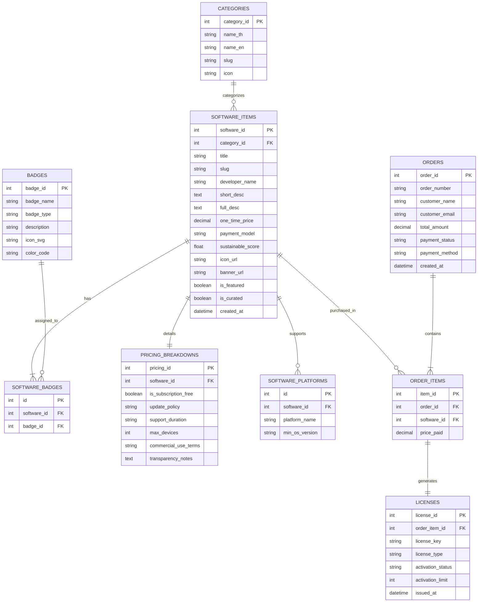

# 📄 Part 4: Database Design — The One-Time Shop (MVP กลุ่ม 2)
### เอกสารการออกแบบฐานข้อมูล (Database Architecture & Schema Design)

> **เอกสารอ้างอิง:** [message.txt](file:///D:/Thanatpreecha/lab-doc/message.txt) และ [A.txt](file:///D:/Thanatpreecha/lab-doc/A.txt)  
> **เอกสารในชุดโครงการ:**
> 1. [Project Charter](file:///D:/Thanatpreecha/lab-doc/docs/project_charter.md)
> 2. [Requirements Specification](file:///D:/Thanatpreecha/lab-doc/docs/requirements_specification.md)
> 3. [Acceptance Criteria](file:///D:/Thanatpreecha/lab-doc/docs/acceptance_criteria.md)
> 4. [Database Design](file:///D:/Thanatpreecha/lab-doc/docs/database_design.md) *(เอกสารนี้)*

---

## 1. ภาพรวมการออกแบบฐานข้อมูล (Database Overview)

การออกแบบฐานข้อมูลสำหรับ **The One-Time Shop (MVP กลุ่ม 2)** มุ่งเน้นความยืดหยุ่นในการจัดเก็บข้อมูลซอฟต์แวร์คัดสรร ป้ายการันตี (Badges) ระบบจัดหมวดหมู่ การแจกแจงความโปร่งใสด้านราคา และการออกสิทธิ์การใช้งานถาวร (Lifetime License) โดยรองรับการพัฒนาด้วย **Visual Studio** และการเชื่อมต่อ API ที่มีประสิทธิภาพ

---

## 2. แผนภาพความสัมพันธ์ของข้อมูล (Entity-Relationship Diagram - ERD)



---

## 3. พจนานุกรมข้อมูล (Data Dictionary & Table Specifications)

### 3.1 ตาราง `categories` (หมวดหมู่ของซอฟต์แวร์)
เก็บข้อมูลหมวดหมู่ซอฟต์แวร์ตามการใช้งาน

| Column Name | Data Type | Nullable | Key | คำอธิบาย |
| :--- | :--- | :---: | :---: | :--- |
| `category_id` | INT | NO | PK | รหัสหมวดหมู่ (Auto Increment) |
| `name_th` | VARCHAR(100) | NO | - | ชื่อหมวดหมู่ภาษาไทย (เช่น เครื่องมือพัฒนาโปรแกรม) |
| `name_en` | VARCHAR(100) | NO | - | ชื่อหมวดหมู่ภาษาอังกฤษ (เช่น Developer Tools) |
| `slug` | VARCHAR(100) | NO | UNIQUE | URL Slug สำหรับคัดกรอง |
| `icon` | VARCHAR(50) | YES | - | ชื่อ Icon Identifier |

---

### 3.2 ตาราง `badges` (ป้ายการันตีความน่าเชื่อถือและความยั่งยืน)
เก็บป้ายการันตีต่างๆ สำหรับติดกำกับซอฟต์แวร์

| Column Name | Data Type | Nullable | Key | คำอธิบาย |
| :--- | :--- | :---: | :---: | :--- |
| `badge_id` | INT | NO | PK | รหัสป้ายการันตี (Auto Increment) |
| `badge_name` | VARCHAR(100) | NO | - | ชื่อป้าย (เช่น One-Time Certified, Sustainable Badge) |
| `badge_type` | VARCHAR(50) | NO | - | ประเภทป้าย (GUARANTEE / SUSTAINABLE / OPEN_SOURCE) |
| `description` | TEXT | NO | - | คำอธิบายความหมายของป้ายเพื่อแสดงใน Tooltip |
| `icon_svg` | VARCHAR(100) | YES | - | ไอคอนหรือ SVG Badge |
| `color_code` | VARCHAR(20) | YES | - | โทนสีของป้าย (เช่น #10B981) |

---

### 3.3 ตาราง `software_items` (ข้อมูลซอฟต์แวร์ในคลังแอป)
เก็บข้อมูลรายละเอียดของแต่ละซอฟต์แวร์ในคลังคัดสรร

| Column Name | Data Type | Nullable | Key | คำอธิบาย |
| :--- | :--- | :---: | :---: | :--- |
| `software_id` | INT | NO | PK | รหัสซอฟต์แวร์ (Auto Increment) |
| `category_id` | INT | NO | FK | รหัสหมวดหมู่ (FK -> `categories.category_id`) |
| `title` | VARCHAR(200) | NO | - | ชื่อโปรแกรมซอฟต์แวร์ |
| `slug` | VARCHAR(200) | NO | UNIQUE | URL Slug สำหรับหน้ารายละเอียด |
| `developer_name`| VARCHAR(150) | NO | - | ชื่อผู้พัฒนาหรือทีมพัฒนา |
| `short_desc` | VARCHAR(300) | NO | - | คำอธิบายแบบย่อสำหรับแสดงบนการ์ด |
| `full_desc` | TEXT | NO | - | รายละเอียดและฟังก์ชันการทำงานฉบับเต็ม |
| `one_time_price`| DECIMAL(10,2)| NO | - | ราคาซื้อขาด (บาท) |
| `payment_model` | VARCHAR(50) | NO | - | โมเดลราคา (ONE_TIME / PAY_PER_USE / OPEN_SOURCE_SUPPORT) |
| `sustainable_score`| DECIMAL(3,1)| NO | - | คะแนนความยั่งยืน (เช่น 9.5 เต็ม 10) |
| `icon_url` | VARCHAR(255) | YES | - | URL รูปไอคอนแอป |
| `banner_url` | VARCHAR(255) | YES | - | URL รูปภาพแบนเนอร์/ภาพสกรีนช็อต |
| `is_featured` | BOOLEAN | NO | - | ซอฟต์แวร์แนะนำเด่นประจำสัปดาห์ (TRUE/FALSE) |
| `is_curated` | BOOLEAN | NO | - | ผ่านการคัดสรรมาตรฐาน (TRUE/FALSE) |
| `created_at` | DATETIME | NO | - | วันเวลาที่เพิ่มข้อมูลในระบบ |

---

### 3.4 ตาราง `pricing_breakdowns` (โครงสร้างแจกแจงความโปร่งใสด้านราคา)
เก็บรายละเอียดและเงื่อนไขสิทธิ์การใช้งานสำหรับหน้ารายละเอียดและราคา

| Column Name | Data Type | Nullable | Key | คำอธิบาย |
| :--- | :--- | :---: | :---: | :--- |
| `pricing_id` | INT | NO | PK | รหัสเงื่อนไขราคา (Auto Increment) |
| `software_id` | INT | NO | FK | รหัสซอฟต์แวร์ (FK -> `software_items.software_id`) |
| `is_subscription_free` | BOOLEAN | NO | - | ยืนยันไม่มีค่าบริการรายเดือน (Default: TRUE) |
| `update_policy` | VARCHAR(255) | NO | - | นโยบายการอัปเดต (เช่น Lifetime Minor Updates) |
| `support_duration` | VARCHAR(255) | NO | - | ระยะเวลาและการให้บริการ Support |
| `max_devices` | INT | NO | - | จำนวนอุปกรณ์ที่อนุญาตให้ติดตั้งต่อ 1 License |
| `commercial_use_terms` | VARCHAR(255) | NO | - | สิทธิ์การใช้งานเชิงพาณิชย์ |
| `transparency_notes` | TEXT | YES | - | หมายเหตุความโปร่งใสเพิ่มเติม |

---

### 3.5 ตาราง `orders` & `order_items` (บันทึกคำสั่งซื้อแบบซื้อขาด)

**ตาราง `orders`:**
* `order_id` (PK, INT): รหัสคำสั่งซื้อ
* `order_number` (VARCHAR(50), UNIQUE): หมายเลขคำสั่งซื้อ (เช่น OTS-20260816-001)
* `customer_name` (VARCHAR(150)): ชื่อผู้ซื้อ
* `customer_email` (VARCHAR(150)): อีเมลสำหรับส่งมอบ License
* `total_amount` (DECIMAL(10,2)): ยอดเงินรวมสุทธิ
* `payment_status` (VARCHAR(30)): สถานะการชำระเงิน (PAID / PENDING / FAILED)
* `payment_method` (VARCHAR(50)): ช่องทางชำระเงิน (PROMPTPAY / CREDIT_CARD / TRUEMONEY)
* `created_at` (DATETIME): วันเวลาที่สั่งซื้อ

**ตาราง `order_items`:**
* `item_id` (PK, INT): รหัสรายการสินค้า
* `order_id` (FK, INT): อ้างอิงคำสั่งซื้อ
* `software_id` (FK, INT): ซอฟต์แวร์ที่ซื้อ
* `price_paid` (DECIMAL(10,2)): ราคาซื้อขาด ณ ขณะสั่งซื้อ

---

### 3.6 ตาราง `licenses` (สิทธิ์การใช้งานถาวร Lifetime License)
เก็บรหัส License Key และสถานะการเปิดใช้งาน

| Column Name | Data Type | Nullable | Key | คำอธิบาย |
| :--- | :--- | :---: | :---: | :--- |
| `license_id` | INT | NO | PK | รหัส License (Auto Increment) |
| `order_item_id`| INT | NO | FK | รหัสรายการสั่งซื้อ (FK -> `order_items.item_id`) |
| `license_key` | VARCHAR(100) | NO | UNIQUE | รหัส License Key (เช่น `OTS-LIFETIME-XXXX-YYYY`) |
| `license_type` | VARCHAR(50) | NO | - | ประเภทสิทธิ์ (LIFETIME_STANDALONE) |
| `activation_status`| VARCHAR(30) | NO | - | สถานะสิทธิ์ (ACTIVE / REVOKED) |
| `activation_limit` | INT | NO | - | จำนวนครั้งสูงสุดที่สามารถ Activate ได้ |
| `issued_at` | DATETIME | NO | - | วันเวลาที่ออกสิทธิ์ |

---

## 4. ตัวอย่างข้อมูลเริ่มต้น (Sample Seed Data)

```sql
-- 1. Insert Categories
INSERT INTO categories (name_th, name_en, slug, icon) VALUES
('เครื่องมือพัฒนาโปรแกรม', 'Developer Tools', 'dev-tools', 'code-bracket'),
('งานออกแบบและกราฟิก', 'Design & Creative', 'design', 'paint-brush'),
('เครื่องมือเพิ่มประสิทธิภาพ', 'Productivity', 'productivity', 'bolt');

-- 2. Insert Badges
INSERT INTO badges (badge_name, badge_type, description, color_code) VALUES
('One-Time Certified', 'GUARANTEE', 'รับรองการซื้อขาด 100% ปราศจากค่าบริการรายเดือน', '#10B981'),
('Sustainable Badge', 'SUSTAINABLE', 'ผ่านเกณฑ์มาตรฐานความโปร่งใสและคุ้มค่าระยะยาว', '#3B82F6'),
('No Hidden Fees', 'GUARANTEE', 'ไม่มีค่าใช้จ่ายแอบแฝง จ่ายครั้งเดียวจบ', '#8B5CF6');

-- 3. Insert Software Item
INSERT INTO software_items (category_id, title, slug, developer_name, short_desc, full_desc, one_time_price, payment_model, sustainable_score, is_featured, is_curated, created_at)
VALUES (1, 'DevHub Pro', 'devhub-pro', 'IndieLogic Studio', 'Git Client & API Workspace ซื้อขาดทรงพลัง', 'เครื่องมือบริหารจัดการ Git และ Workspace ระดับมืออาชีพที่ออกแบบมาเพื่อลดความซับซ้อนและเพิ่มความเร็วในการทำงาน', 1490.00, 'ONE_TIME', 9.6, TRUE, TRUE, NOW());
```
