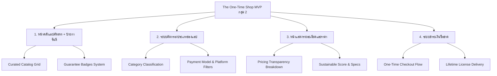
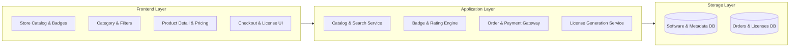

# 📋 Part 1: Project Charter — The One-Time Shop (MVP กลุ่ม 2)
### ระบบพันธมิตรซอฟต์แวร์ยั่งยืน (Sustainable Software Movement Marketplace)

> **เอกสารอ้างอิง:** [message.txt](file:///D:/Thanatpreecha/lab-doc/message.txt) และ [A.txt](file:///D:/Thanatpreecha/lab-doc/A.txt)  
> **เอกสารในชุดโครงการ:**
> 1. [Project Charter](file:///D:/Thanatpreecha/lab-doc/docs/project_charter.md) *(เอกสารนี้)*
> 2. [Requirements Specification](file:///D:/Thanatpreecha/lab-doc/docs/requirements_specification.md)
> 3. [Acceptance Criteria](file:///D:/Thanatpreecha/lab-doc/docs/acceptance_criteria.md)
> 4. [Database Design](file:///D:/Thanatpreecha/lab-doc/docs/database_design.md)

---

## 1. ข้อมูลภาพรวมโครงการ (Project Overview)

| มิติข้อมูล | รายละเอียด |
| :--- | :--- |
| **ชื่อโครงการ** | **The One-Time Shop** (ระบบพันธมิตรซอฟต์แวร์ยั่งยืน) |
| **กลุ่มผู้พัฒนา** | **MVP กลุ่ม 2** |
| **เครื่องมือและสภาพแวดล้อมการพัฒนา** | **Visual Studio** ร่วมกับ **AI-Assisted Coding** (อ้างอิง [A.txt](file:///D:/Thanatpreecha/lab-doc/A.txt)) |
| **สถานะโครงการ** | MVP Phase 1 (Core Storefront, Filter, Detail & One-Time Payment Flow) |
| **ประเภทของระบบ** | Web Application Marketplace / Software Distribution Platform |
| **วิสัยทัศน์ (Vision)** | *“สร้างระบบนิเวศซอฟต์แวร์ที่ผู้ใช้มีทางเลือก นักพัฒนาได้รับรายได้อย่างเป็นธรรม และซอฟต์แวร์สามารถเติบโตได้อย่างยั่งยืนด้วยรูปแบบการซื้อขาดที่โปร่งใสและคุ้มค่าตลอดอายุการใช้งาน”* |

---

## 2. ความเป็นมาและปัญหาหลัก (Background & Problem Statement)

จากการวิเคราะห์ปัญหาผ่านกระบวนการ Design Thinking (Empathize & Define) ตาม [message.txt](file:///D:/Thanatpreecha/lab-doc/message.txt):

### 2.1 ปัญหาฝั่งผู้ใช้งาน (User Pain Points)
1. **Subscription Fatigue (ภาวะเหนื่อยล้าจากค่าบริการรายเดือน):** ผู้ใช้ต้องจ่ายค่าบริการต่อเนื่องหลายบริการจนกลายเป็นภาระค่าใช้จ่ายระยะยาว
2. **ขาดความโปร่งใสด้านราคา (Lack of Pricing Transparency):** ผู้ใช้ไม่ทราบว่าซอฟต์แวร์ใดมีรูปแบบ **ซื้อขาด (One-Time Purchase)** และมักเจอกับค่าใช้จ่ายแอบแฝง (Hidden Fees) หรือการบังคับต่ออายุ
3. **การเข้าถึงซอฟต์แวร์คุณภาพทำได้ยาก:** ซอฟต์แวร์ซื้อขาดคุณภาพสูงกระจัดกระจาย ขาดตัวกลางที่ช่วยคัดกรองและให้การรับรองความน่าเชื่อถือ

### 2.2 ปัญหาฝั่งนักพัฒนา (Developer Pain Points)
1. **ขาดช่องทางจัดจำหน่ายที่เป็นธรรม:** นักพัฒนาอิสระ (Indie Devs) ขาดพื้นที่เปิดตัวซอฟต์แวร์แบบซื้อขาดที่เข้าถึงกลุ่มลูกค้าที่มีกำลังซื้อโดยตรง
2. **Open-Source Monetization Challenge:** นักพัฒนา Open Source ต้องการสร้างรายได้อย่างยั่งยืน (ผ่าน Support, Add-on, Sponsorship) โดยไม่ต้องบังคับเปลี่ยนไปใช้ Subscription

### 2.3 กรอบคำถามชี้นำ (How Might We?)
> **“เราจะสร้าง Marketplace ที่ช่วยให้ผู้ใช้ค้นหาและตัดสินใจซื้อ Software แบบซื้อขาดได้อย่างมั่นใจ โปร่งใส และคุ้มค่าระยะยาว พร้อมทั้งสร้างช่องทางให้นักพัฒนาสร้างรายได้อย่างเป็นธรรมได้อย่างไร?”**

---

## 3. วัตถุประสงค์และเป้าหมายโครงการ (Project Objectives)

* **ความโปร่งใส 100%:** เปิดเผยข้อมูลราคา ขอบเขตการอัปเดต และสิทธิ์การใช้งานอย่างชัดเจนก่อนชำระเงิน
* **ความคุ้มค่าตลอดอายุการใช้งาน (Lifetime Value):** ชูจุดเด่นการ "ซื้อครั้งเดียว จบ ใช้งานคุ้มตลอดไป" ปราศจากการผูกมัดบัตรตัดเงินอัตโนมัติ
* **คลังซอฟต์แวร์คุณภาพพร้อมป้ายการันตี:** สร้างความมั่นใจให้ผู้ซื้อด้วยระบบคัดสรรและป้ายรับรองมาตรฐานความยั่งยืน
* **สถาปัตยกรรมการพัฒนาสมัยใหม่:** พัฒนาบน **Visual Studio** ร่วมกับกระบวนการ **AI Coding** เพื่อความรวดเร็วและแม่นยำ

---

## 4. ขอบเขตฟีเจอร์หลัก MVP กลุ่ม 2 (MVP Scope)

1. **หน้าคลังแอปคัดสรร + ป้ายการันตี (Curated Catalog & Guarantee Badges):** หน้าร้านรวบรวมแอปที่ผ่านการคัดสรร พร้อมป้ายรับรอง (One-Time Certified, Sustainable Badge, No Hidden Fees)
2. **ระบบคัดกรองประเภทของแอป (Category & Smart Filter):** กรองตามหมวดหมู่การใช้งาน (Developer Tools, Design, Productivity ฯลฯ), รูปแบบราคา และระบบปฏิบัติการ
3. **หน้าแสดงรายละเอียดและราคา (Software Detail & Transparent Pricing):** แสดงข้อมูลฟังก์ชันเชิงลึก แจกแจงโครงสร้างราคาซื้อขาดสุทธิ ขอบเขตการอัปเดต และระยะเวลา Support
4. **ระบบชำระเงินซื้อขาด (One-Time Payment & Lifetime License):** ระบบสั่งซื้อแบบจ่ายครั้งเดียวจบ ไม่ผูกบัตรตัดเงินอัตโนมัติ พร้อมส่งมอบ License Key แบบถาวร

---

## 5. ผู้มีส่วนได้ส่วนเสียและกลุ่มเป้าหมาย (Stakeholders & Target Persona)

| กลุ่มผู้ใช้ | ลักษณะและพฤติกรรม | ประโยชน์ที่ได้รับจาก MVP กลุ่ม 2 |
| :--- | :--- | :--- |
| **นักศึกษา / ผู้ใช้งานทั่วไป** | งบประมาณจำกัด ต้องการเครื่องมือทำงานที่ไม่ต้องจ่ายรายเดือน | จ่ายครั้งเดียวใช้งานได้ตลอดการศึกษา ไร้ภาระค่าบริการแฝง |
| **Freelancer / Indie Creators** | ต้องการควบคุมต้นทุนคงที่ (Fixed Cost) ของอุปกรณ์และเครื่องมือ | รู้ต้นทุนที่แท้จริง คืนทุนเร็ว ใช้งานได้ยาวนาน |
| **Programmer / Designer** | มองหาเครื่องมือคุณภาพสูงที่ปรับแต่งได้และซื้อขาด | เข้าถึงเครื่องมือเฉพาะทางและสนับสนุนนักพัฒนาโดยตรง |
| **ธุรกิจขนาดเล็ก (SMEs)** | ต้องการซอฟต์แวร์ลิขสิทธิ์ถูกต้องที่จัดการงบประมาณง่าย | ลดภาระผูกพันทางการเงินระยะยาว ง่ายต่อการทำบัญชี |
| **นักพัฒนาอิสระ / Open-Source Devs** | พัฒนาโปรแกรมคุณภาพดีแต่ขาดช่องทางขายที่ไม่บังคับ Subscription | ได้รับรายได้ที่เป็นธรรม มีช่องทางขาย Add-on และ Support |

---

## 6. สถาปัตยกรรมระดับสูง (High-Level Architecture)

---

## 7. ตัวชี้วัดความสำเร็จ (Key Success Metrics / KPIs)

1. **User Trust & Transparency Index:** ผู้ใช้งาน 100% สามารถตรวจสอบราคา เงื่อนไข และป้ายรับรองได้ชัดเจนโดยไม่พบค่าใช้จ่ายแอบแฝง
2. **Catalog Discovery Efficiency:** ผู้ใช้สามารถค้นหาและกรองซอฟต์แวร์ตามหมวดหมู่หรือเงื่อนไขราคาได้ภายใน 3 คลิก
3. **Checkout Completion Rate:** อัตราการดำเนินการสั่งซื้อและออก License Key สำเร็จราบรื่น
4. **Deliverables Completion:** ส่งมอบเอกสารครบทั้ง 4 ส่วนและตัวต้นแบบ MVP ตรงตามข้อกำหนด
