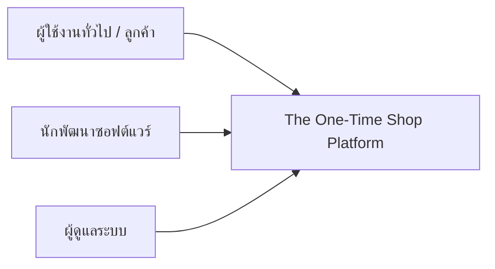
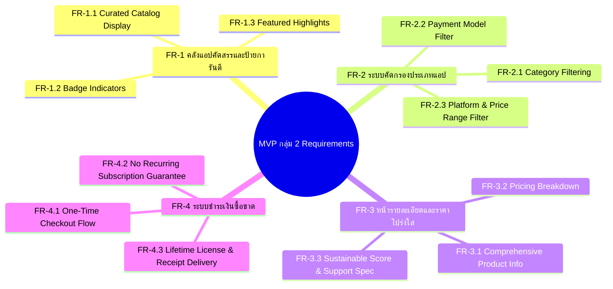

# 📄 Part 2: Requirements Specification — The One-Time Shop (MVP กลุ่ม 2)
### เอกสารข้อกำหนดความต้องการระบบ (System Requirements Specification - SRS)

> **เอกสารอ้างอิง:** [message.txt](file:///D:/Thanatpreecha/lab-doc/message.txt) และ [A.txt](file:///D:/Thanatpreecha/lab-doc/A.txt)  
> **เอกสารในชุดโครงการ:**
> 1. [Project Charter](file:///D:/Thanatpreecha/lab-doc/docs/project_charter.md)
> 2. [Requirements Specification](file:///D:/Thanatpreecha/lab-doc/docs/requirements_specification.md) *(เอกสารนี้)*
> 3. [Acceptance Criteria](file:///D:/Thanatpreecha/lab-doc/docs/acceptance_criteria.md)
> 4. [Database Design](file:///D:/Thanatpreecha/lab-doc/docs/database_design.md)

---

## 1. วัตถุประสงค์และขอบเขตของระบบ (Purpose & Scope)

เอกสารนี้ระบุข้อกำหนดความต้องการเชิงฟังก์ชัน (Functional Requirements) และข้อกำหนดที่ไม่ใช่เชิงฟังก์ชัน (Non-Functional Requirements) สำหรับระบบ **The One-Time Shop (MVP กลุ่ม 2)** เพื่อใช้เป็นมาตรฐานในการออกแบบ พัฒนาด้วย **Visual Studio / AI Coding** และตรวจสอบความถูกต้องของระบบ

---

## 2. บทบาทของผู้ใช้งานในระบบ (User Roles)

| บทบาท (Role) | คำอธิบายและสิทธิ์การใช้งาน |
| :--- | :--- |
| **Guest / Buyer (ผู้ใช้งาน/ผู้ซื้อ)** | สามารถเรียกดูคลังแอป คัดกรองหมวดหมู่ ดูป้ายการันตี ดูรายละเอียดราคาโปร่งใส และทำการสั่งซื้อซอฟต์แวร์แบบซื้อขาด |
| **Developer (นักพัฒนาซอฟต์แวร์)** | ส่งมอบข้อมูลซอฟต์แวร์ กำหนดราคาซื้อขาด แจกแจงเงื่อนไข Support/Update และรับผลตอบแทน |
| **Platform Administrator (ผู้ดูแลระบบ)** | ตรวจสอบคุณภาพซอฟต์แวร์ ตรวจสอบความโปร่งใส อนุมัติป้ายการันตี (Badges) และดูแลคำสั่งซื้อ |

---

## 3. ข้อกำหนดเชิงฟังก์ชัน (Functional Requirements - FR)

### 3.1 FR-1: หน้าคลังแอปคัดสรร + ป้ายการันตี (Curated Catalog & Badges)

* **FR-1.1 แสดงรายการแอปในคลัง (Catalog Listing):** ระบบต้องแสดงรายการซอฟต์แวร์ที่ผ่านการคัดสรรในรูปแบบ Grid/Card แสดงชื่อแอป, ไอคอน, ผู้พัฒนา, หมวดหมู่, ราคาซื้อขาด และป้ายรับรอง
* **FR-1.2 แสดงป้ายการันตีความยั่งยืน (Guarantee Badges):** ระบบต้องแสดงป้ายกำกับบนการ์ดและหน้ารายละเอียดอย่างเด่นชัด ได้แก่:
  * 🛡️ `One-Time Certified` — รับรองการซื้อขาด 100%
  * 🌱 `Sustainable Software Badge` — รับรองมาตรฐานความโปร่งใสและการบำรุงรักษาต่อเนื่อง
  * ⚡ `No Hidden Fees` — รับรองไม่มีค่าใช้จ่ายแอบแฝง
  * 🔓 `Open Source + Support` — รับรองโมเดลโอเพนซอร์สพร้อมบริการ Support
* **FR-1.3 พื้นที่ซอฟต์แวร์แนะนำ (Featured Showcase):** ระบบต้องมีส่วนไฮไลต์แอปเด่นประจำสัปดาห์และแอปที่ได้คะแนนความยั่งยืนสูงสุด

---

### 3.2 FR-2: ระบบคัดกรองประเภทของแอป (Category & Smart Filter System)

* **FR-2.1 กรองตามหมวดหมู่การใช้งาน (Category Filtering):**
  * Developer Tools (เครื่องมือพัฒนาโปรแกรม)
  * Design & Creative (งานออกแบบ กราฟิก และสื่อ)
  * Productivity & Utilities (เครื่องมือเพิ่มประสิทธิภาพการทำงาน)
  * System & Security (ความปลอดภัยและเครื่องมือระบบ)
  * Business & Finance (เครื่องมือธุรกิจ การเงิน และจัดการร้านค้า)
* **FR-2.2 กรองตามรูปแบบราคา (Monetization Model Filtering):**
  * One-Time Purchase (ซื้อขาด)
  * Pay-per-use (จ่ายตามการใช้งาน)
  * Pay-what-you-want (จ่ายตามความพึงพอใจ)
  * Open Source + Paid Support
* **FR-2.3 กรองตามระบบปฏิบัติการ (Platform Filtering):** Windows, macOS, Linux, Web/Cloud
* **FR-2.4 ค้นหาด้วยคีย์เวิร์ด (Search Function):** ค้นหาตามชื่อซอฟต์แวร์ ฟีเจอร์ หรือชื่อนักพัฒนาได้แบบ Real-time

---

### 3.3 FR-3: หน้าแสดงรายละเอียดและราคา (Software Detail & Transparent Pricing Page)

* **FR-3.1 แสดงข้อมูลเชิงลึกของซอฟต์แวร์:** แสดงภาพตัวอย่าง (Screenshots), คำอธิบายฟังก์ชัน, สเปกเครื่องขั้นต่ำ (System Requirements), คะแนนรีวิว
* **FR-3.2 แจกแจงโครงสร้างราคาแบบโปร่งใส (Pricing Breakdown Table):**
  * แสดงราคาซื้อขาดสุทธิ (Net One-Time Price) ไร้เงื่อนไขแอบแฝง
  * แสดงป้ายยืนยัน `ไม่มีค่าบริการรายเดือน / ไม่ผูกบัตร`
  * ระบุขอบเขตการอัปเดตเวอร์ชัน (เช่น Lifetime Minor Updates + 1 Year Major Updates)
  * ระบุระยะเวลาและการให้บริการ Support ทางเทคนิค (เช่น Email Support ภายใน 24 ชม.)
  * ระบุสิทธิ์การติดตั้ง (เช่น ใช้งานได้ 3 เครื่องต่อ 1 License)
* **FR-3.3 คะแนนความยั่งยืน (Sustainable Software Score):** แสดงเกจวัดคะแนนประเมินความโปร่งใส ความคุ้มค่า และประวัติการอัปเดตจากนักพัฒนา

---

### 3.4 FR-4: ระบบชำระเงินซื้อขาดและส่งมอบ License (One-Time Payment & License Delivery)

* **FR-4.1 กระบวนการชำระเงินซื้อขาด (One-Time Checkout):**
  * ตะกร้าสินค้าสรุปยอดชำระครั้งเดียว (ไม่มีตัวเลือก Subscription หรือบังคับ Recurring Payment)
  * รองรับการชำระเงินผ่าน PromptPay QR, บัตรเครดิต/เดบิต, TrueMoney
* **FR-4.2 ยืนยันคำสั่งซื้อและออก License อัตโนมัติ (Instant Key Generation):**
  * สร้างรหัสสิทธิ์การใช้งานถาวร (Lifetime License Key) รูปแบบเฉพาะ
  * แสดงลิงก์ดาวน์โหลดตัวติดตั้งอย่างปลอดภัย
  * ส่งใบเสร็จรับเงินดิจิทัลและข้อมูล License ทางอีเมลของผู้ซื้อ

---

## 4. ข้อกำหนดที่ไม่ใช่เชิงฟังก์ชัน (Non-Functional Requirements - NFR)

| รหัส | หัวข้อ | ข้อกำหนดความต้องการ |
| :--- | :--- | :--- |
| **NFR-1** | **Transparency & Clarity** | ข้อมูลราคา สิทธิ์การใช้งาน และเงื่อนไขการอัปเดตต้องแสดงอย่างชัดเจน 100% ในทุกจุดการตัดสินใจซื้อ |
| **NFR-2** | **Performance** | เวลาในการโหลดหน้าคลังแอปและผลลัพธ์การกรองต้องไม่เกิน 1.5 วินาทีภายใต้การเชื่อมต่อปกติ |
| **NFR-3** | **Responsive Design** | รองรับการแสดงผลบน Desktop, Tablet และ Mobile อย่างสมบูรณ์แบบโดยไม่มีข้อมูลตกหล่น |
| **NFR-4** | **Security & Privacy** | การชำระเงินจำลองต้องไม่มีการเก็บข้อมูลบัตรเครดิตที่อ่อนไหว และมีการเข้ารหัส License Key |
| **NFR-5** | **Maintainability** | โค้ดได้รับการพัฒนาด้วย Visual Studio มีโครงสร้างที่อ่านง่ายและรองรับการขยายผลด้วย AI Coding |

---

## 5. ตารางความสัมพันธ์ข้อกำหนด (Traceability Matrix)

| Feature Module | Functional Requirement | Non-Functional Requirement | Test Case Reference |
| :--- | :--- | :--- | :--- |
| **คลังแอป + ป้ายการันตี** | FR-1.1, FR-1.2, FR-1.3 | NFR-1, NFR-2, NFR-3 | TC-CAT-01, TC-BADGE-01 |
| **ระบบคัดกรองประเภท** | FR-2.1, FR-2.2, FR-2.3, FR-2.4 | NFR-2, NFR-3 | TC-FILT-01, TC-SRCH-01 |
| **หน้ารายละเอียด & ราคา** | FR-3.1, FR-3.2, FR-3.3 | NFR-1, NFR-3 | TC-DET-01, TC-PRICE-01 |
| **ระบบชำระเงินซื้อขาด** | FR-4.1, FR-4.2 | NFR-1, NFR-4 | TC-PAY-01, TC-LIC-01 |
